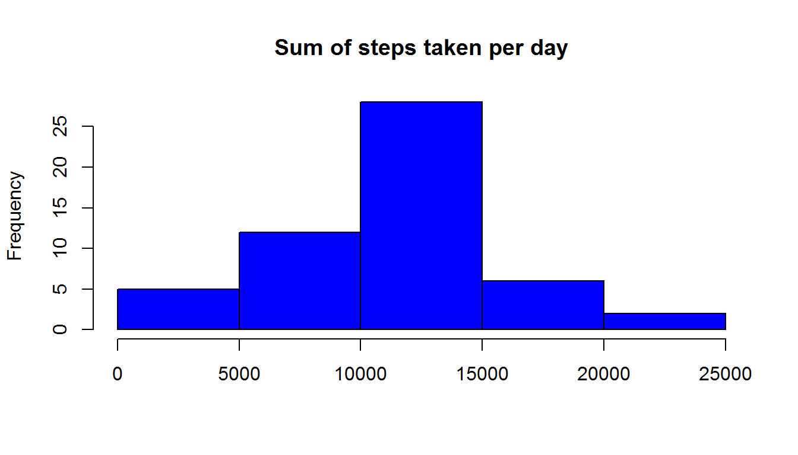
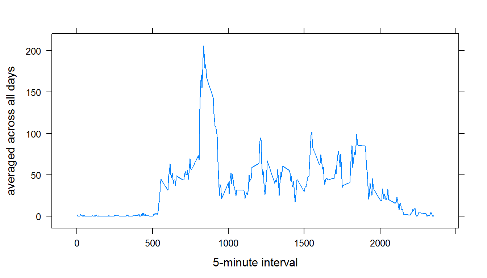
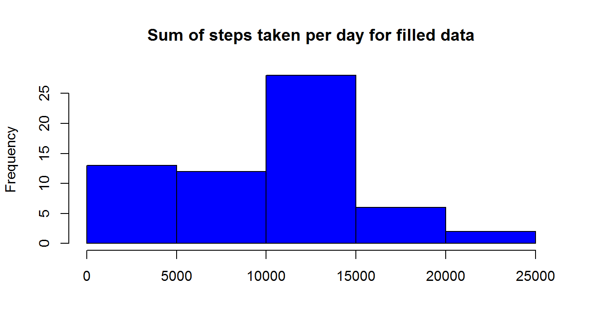
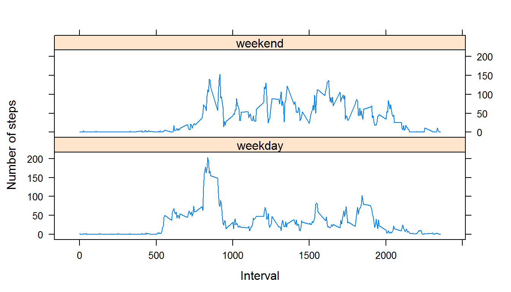

Reproducible Research Assignment 1
====================================
### Introduction
This file consist multiple parts for Activity Monitoring Data which is about personal movement using activity monitoring device.This device collects data at 5 minute intervals through out the day.The data consists of two months of data from an anonymous individual collected during the months of October and November, 2012 and include the number of steps taken in 5 minute intervals each day.


```r
data=read.csv("activity.csv")
Sys.setlocale("LC_TIME", "English")
```

```
## [1] "English_United States.1252"
```

```r
library(lattice)
str(data)
```

```
## 'data.frame':	17568 obs. of  3 variables:
##  $ steps   : int  NA NA NA NA NA NA NA NA NA NA ...
##  $ date    : Factor w/ 61 levels "2012-10-01","2012-10-02",..: 1 1 1 1 1 1 1 1 1 1 ...
##  $ interval: int  0 5 10 15 20 25 30 35 40 45 ...
```
###Calculating  mean total number of steps taken per day


```r
sums=aggregate(steps~ date,data,sum)
hist(sums$steps,xlab=" ",main="Sum of steps taken per day",col="blue")
```

 

```r
data.frame(mean=mean(sums$steps),median=median(sums$steps))
```

```
##       mean median
## 1 10766.19  10765
```
 
###The average daily activity pattern

```r
 averagedata=aggregate(steps~ interval,data,mean)
xyplot(steps~interval,data=averagedata,type="l",ylab="averaged across all days",xlab="5-minute interval")
```

 

```r
averagedata$interval[which.max(averagedata$steps)]
```

```
## [1] 835
```
###Imputing missing values


```r
sum(sapply(data$steps,is.na))
```

```
## [1] 2304
```

```r
means=aggregate(steps~ date,data,mean)
means$date=as.character(means$date)
datafilled=data

for (i in 1:length(means$steps))
{ 
  if((sum(sapply(datafilled$steps[datafilled$date==means$date[i]],is.na)))!=0) {
    datafilled$steps[datafilled$date==means$date[i]][is.na(datafilled$steps[datafilled$date==means$date[i]])]=means$steps[i]}
  
}
datafilled$steps[is.na(datafilled$steps)]=0
sums1=aggregate(steps~ date,datafilled,sum)
hist(sums1$steps,xlab=" ",main="Sum of steps taken per day for filled data",col="blue")
```

 

```r
data.frame(mean=mean(sums1$steps),median=median(sums1$steps))
```

```
##      mean median
## 1 9354.23  10395
```
Mean and meadian values found from filled data set are different from their previous values.Since  missing values in each day  have been replaced with mean for that day and zero for missing days, the mean of the total number of steps have decreased ( missing values have been ignored for previous calculations of mean and median therefore missing days have been ignored).

###Differences in activity patterns between weekdays and weekends


```r
datafilled$date=as.character(datafilled$date)
datafilled$date=as.Date(datafilled$date)
day=weekdays(datafilled$date)
days=ifelse(day=="Saturday" | day=="Sunday",TRUE,FALSE)
days[days=="TRUE"]="weekend"
days[days=="FALSE"]="weekday"
datafilled$days=as.factor(days)
averaged1=aggregate(steps~ interval,subset(datafilled,days=="weekday"),mean)
averaged2=aggregate(steps~ interval,subset(datafilled,days=="weekend"),mean)
```

###plotting filled data set 


```r
new=rbind(averaged1,averaged2)
new$day=rep(c("weekday","weekend"),each=288)
new$day=as.factor(new$day)
xyplot(steps ~ interval | day,data=new,type="l",layout=c(1,2),xlab="Interval",ylab="Number of steps")
```

 


